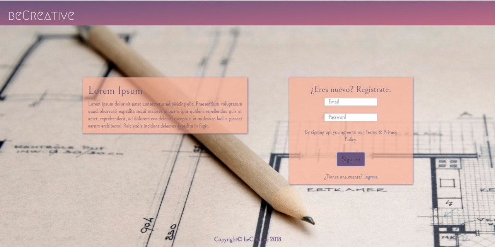
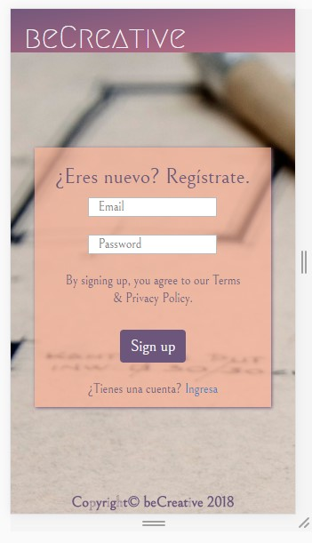
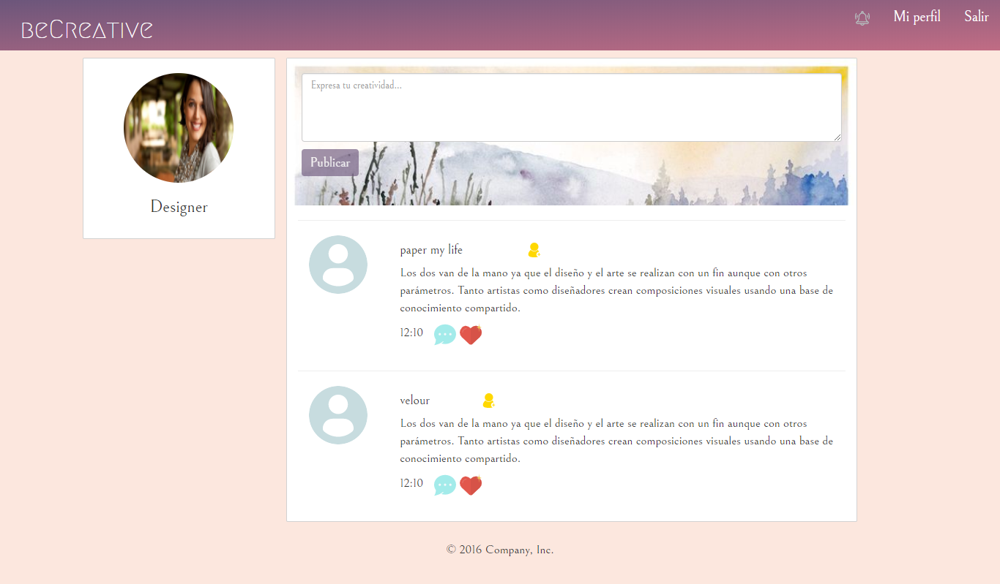
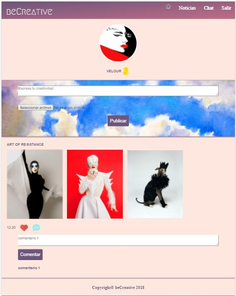
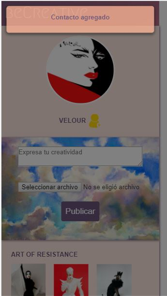
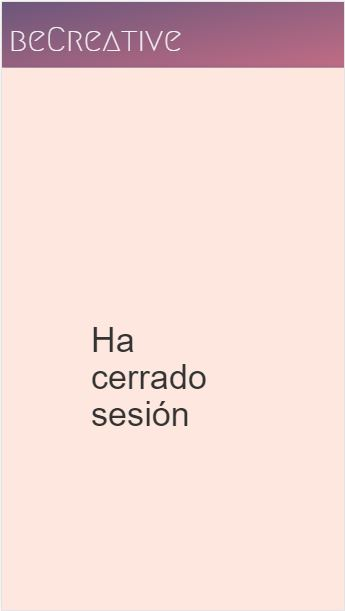

# Red social - beCreative

* **Track:** _Common Core_
* **Curso:** _Crea tu propia red social_
* **Unidad:** _Crea tu propia red social_

***
### Se puede acceder a este proyecto en [Github]( "Github")
***

## Objetivo
---
El reto consiste en realizar una red social mobile friendly con la ayuda del framework Bootstrap y la librería de Javascript jQuery. Esta deberá verse de la siguiente forma para cada una de sus fases con las siguientes especificaciones requeridas:

#### Vista inicial de inicio de sesión o registro
* Versión de computadora

* Versión de móvil

#### Vista de noticias para ver las actualizaciones de amigos artistas con opción a agregar contacto, publicar, comentar y dar y quitar me gusta

### Vista de perfil con opción a agregar contacto, publicar, lugar para subir fotos, comentar y dar y quitar me gusta

#### Vista para agregar contacto

#### Vista final de cerrar sesión

## Autora
* Isabel Campos
* Elizabeth Segura
* Lizbeth Félix

## Fecha
10/01/2018
